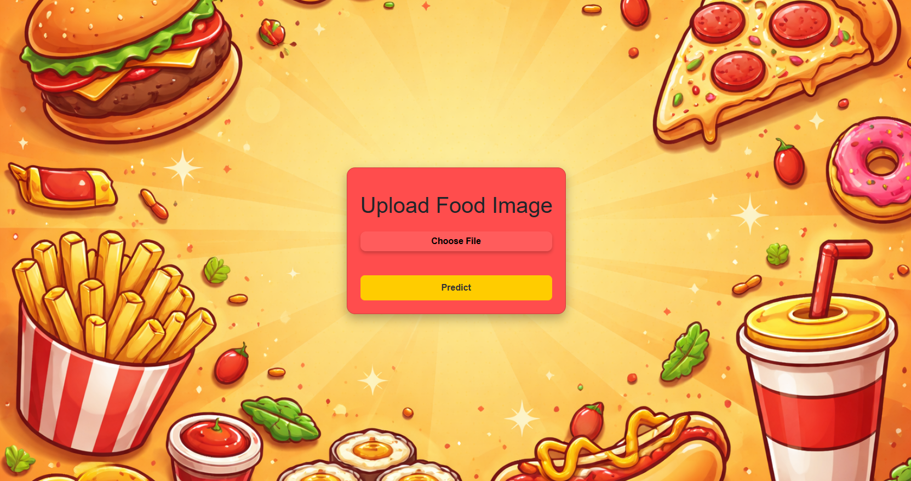
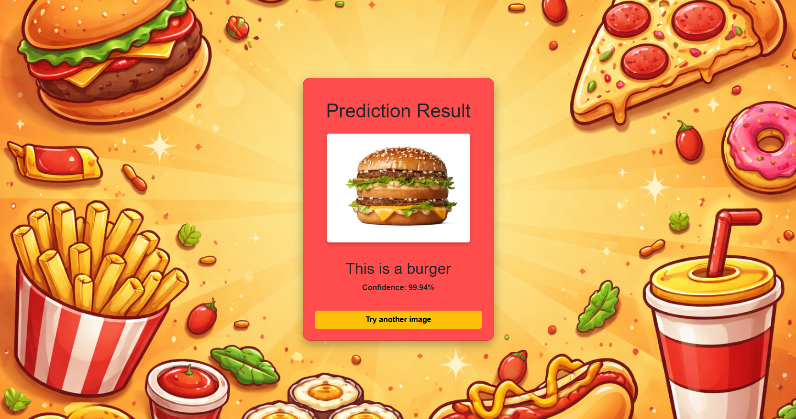
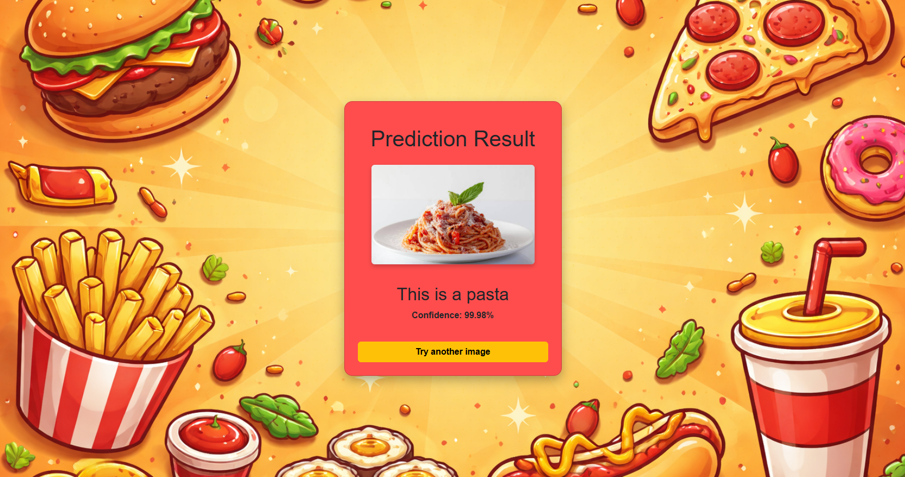
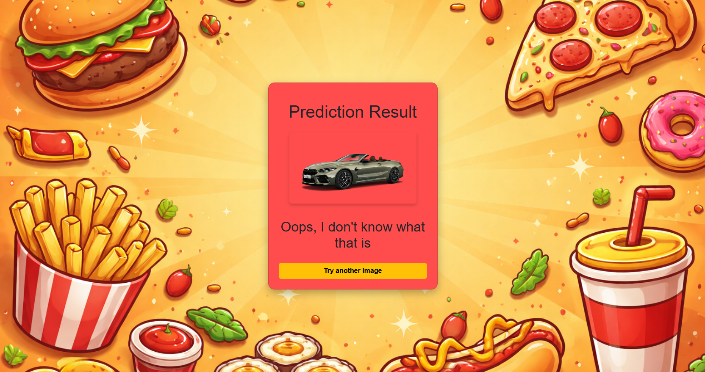

# 🍔 Food Vision


Food Vision is an **educational** 🧠 project that uses a **neural network** to recognize food in images 🍕🍣🍔
and provides a clean, interactive **web interface** built with **Flask** 🌐.

The project focuses on:  
- image classification with deep learning  
- integrating an ML model into a web application  
- clean project structure and user-friendly UI  

---

## 🔍 Features

- 📷 **Upload** food images directly from the browser
- 🧠 **Predict** food category (burger, pizza, pasta, sushi, hotdog)
- 📊 **Display** prediction **confidence (%)**
- ❓ **Graceful** handling of unknown images
- 🎨 **Fast-food** styled **UI** with custom **background**

---
## 🚀 Technologies Used

- 🧠 **TensorFlow / Keras** - image classification model  
- 🌐 **Flask** - backend and routing  
- 📊 **NumPy** - data preprocessing
- 🎨 **Bootstrap + CSS** — responsive UI styling

---

## ⚙️ Setup Guide

### 1️⃣ Create or use the model

- A pre-trained test [model](model/food_classifier.h5) is already included — it recognizes **food types** from images (5 categories) with around **90% accuracy**.  
- You can also train your own model using this **[Google Colab](https://colab.research.google.com/drive/1zx1g6I9R6uG_8-iYNfAxj8H9EXTBHaZy?usp=sharing) example**.  
- After training, save your model in the [`/model`](model/.) directory.  

### 2️⃣ Install dependencies

```bash
python -m venv venv
venv\Scripts\activate   # Windows
source venv/bin/activate   # Linux / macOS
pip install -r requirements.txt
```

### 3️⃣ Run the project

```bash
python app.py
```

---

## 🧠 Model

- The project uses a **pre-trained CNN model**
- Model location:

```bash
model/food_classifier.h5
```

- If the image does not belong to any known class, the app will display:
### "Oops, I don't know what that is"

---

## 🗂️ Project Structure

```
food-vision/
│
├── model/
│   └── food_classifier.h5
│
├── static/
│   ├── css/
│   │   └── styles.css
│   ├── background/
│   ├── images/
│   └── uploads/
│
├── templates/
│   ├── index.html
│   └── result.html
│
├── app.py
├── requirements.txt
├── .flake8
├── .gitignore
└── README.md

```

---

## 🎯 Future Improvements

- 🗂️ Upload history and gallery view
- 👤 User sessions and authentication
- 🧠 More food classes and improved model accuracy
- 📈 Advanced confidence analysis

---

## 📸 Examples



